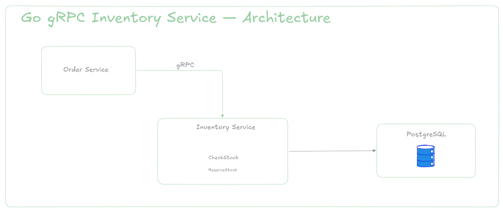

# Go gRPC Inventory Service

Microserviço de inventário desenvolvido em Go, utilizando gRPC, Protocol Buffers, PostgreSQL e Docker.

O serviço é responsável por consultar a disponibilidade de produtos e realizar reservas de estoque de forma transacional e segura contra concorrência.

---

## 🎯 Objetivo

Este projeto simula um **Inventory Service** dentro de uma arquitetura baseada em microserviços.

O serviço disponibiliza duas operações principais:

- **`CheckStock`**: verifica se existe estoque suficiente para um determinado produto.
- **`ReserveStock`**: reserva uma quantidade do produto, decrementando o estoque de forma segura.

### Fluxo de Comunicação



---

## 🏗️ Arquitetura

O projeto adota uma arquitetura em camadas bem delimitada:

```
┌─────────────────────────────┐
│       gRPC Handler          │
│   infrastructure/grpc       │
└──────────────┬──────────────┘
               │
               ▼
┌─────────────────────────────┐
│       Service Layer         │
│       business rules        │
└──────────────┬──────────────┘
               │
               ▼
┌─────────────────────────────┐
│      Repository Layer       │
│         PostgreSQL          │
└──────────────┬──────────────┘
               │
               ▼
┌─────────────────────────────┐
│         PostgreSQL          │
└─────────────────────────────┘
```

### Camadas

- **Domain**: contém as entidades e os erros de negócio.
- **Service**: contém as regras de negócio relacionadas ao controle de estoque.
- **Repository**: responsável pela persistência de dados no PostgreSQL.
- **gRPC Handler**: expõe as operações do serviço através da API gRPC.

---

## 🚀 Tecnologias

- **Go** 1.25
- **gRPC**
- **Protocol Buffers**
- **PostgreSQL** 15
- **Docker** & **Docker Compose**
- **database/sql** + **lib/pq**

---

## 📁 Estrutura do projeto

```text
.
├── api/
│   └── proto/
│       └── inventory/
│           └── v1/
│               └── inventory.proto
├── cmd/
│   └── server/
│       └── main.go
├── infra/
│   ├── Dockerfile
│   └── docker-compose.yml
├── internal/
│   ├── domain/
│   │   └── inventory.go
│   ├── service/
│   │   └── inventory_service.go
│   └── infrastructure/
│       ├── grpc/
│       │   ├── handler.go
│       │   └── pb/
│       ├── migrations/
│       │   └── init.sql
│       └── repository/
│           └── postgres.go
├── Makefile
├── go.mod
├── go.sum
└── README.md
```

---

## ⚙️ Pré-requisitos

Antes de iniciar, certifique-se de ter as seguintes ferramentas instaladas em sua máquina:

- [Go](https://go.dev/)
- [Docker](https://docs.docker.com/) & [Docker Compose](https://docs.docker.com/compose/)
- `protoc` (Protocol Buffers Compiler)
- [`grpcurl`](https://github.com/fullstorydev/grpcurl) (para testes da API gRPC via CLI)

---

## ▶️ Executando o projeto

Clone o repositório:

```bash
git clone https://github.com/ManuelJ0aquim/go-grpc-inventory-service.git
cd go-grpc-inventory-service
```

Suba a infraestrutura via Docker:

```bash
make docker-up
```

O comando iniciará o PostgreSQL na porta `5432` e o Inventory Service na porta `50051`.

Verifique os containers em execução:

```bash
docker ps
```

---

## 🗄️ Banco de dados

A aplicação utiliza PostgreSQL. A migration inicial cria a seguinte estrutura de tabela:

```sql
CREATE TABLE inventory (
    product_id VARCHAR(50) PRIMARY KEY,
    quantity INT NOT NULL CHECK (quantity >= 0),
    updated_at TIMESTAMP WITH TIME ZONE DEFAULT CURRENT_TIMESTAMP
);
```

### Carga de dados inicial

| Produto | Estoque inicial |
| ------- | --------------- |
| prod-1  | 100             |
| prod-2  | 50              |
| prod-3  | 0               |

Para consultar os dados diretamente no banco:

```bash
docker exec -it inventory_postgres \
  psql -U postgres -d inventory_db \
  -c "SELECT * FROM inventory;"
```

---

## 🔌 API gRPC

O contrato gRPC está definido em `api/proto/inventory/v1/inventory.proto`.

### CheckStock

Verifica se há estoque suficiente para o produto solicitado.

```protobuf
rpc CheckStock(CheckStockRequest) returns (CheckStockResponse);
```

### ReserveStock

Realiza a reserva, decrementando a quantidade solicitada do estoque.

```protobuf
rpc ReserveStock(ReserveStockRequest) returns (ReserveStockResponse);
```

---

## 🧪 Testando a aplicação

Você pode utilizar o `grpcurl` para interagir com os métodos gRPC.

### 1. CheckStock — estoque disponível

```bash
grpcurl -plaintext \
  -proto api/proto/inventory/v1/inventory.proto \
  -d '{"product_id":"prod-1","quantity":10}' \
  localhost:50051 \
  inventory.v1.InventoryService/CheckStock
```

Resposta:

```json
{
  "available": true,
  "currentStock": 100
}
```

### 2. CheckStock — estoque insuficiente

```bash
grpcurl -plaintext \
  -proto api/proto/inventory/v1/inventory.proto \
  -d '{"product_id":"prod-1","quantity":150}' \
  localhost:50051 \
  inventory.v1.InventoryService/CheckStock
```

Resposta:

```json
{
  "currentStock": 100
}
```

> **Nota:** no Protobuf v3, campos booleanos com valor `false` usam o valor padrão e podem ser omitidos na serialização JSON — por isso `available` não aparece na resposta acima.

### 3. ReserveStock — reserva realizada

```bash
grpcurl -plaintext \
  -proto api/proto/inventory/v1/inventory.proto \
  -d '{"order_id":"order-001","product_id":"prod-1","quantity":20}' \
  localhost:50051 \
  inventory.v1.InventoryService/ReserveStock
```

Resposta:

```json
{
  "success": true,
  "message": "Estoque reservado com sucesso"
}
```

---

## 📸 Testes via Postman

Além dos testes via `grpcurl`, o serviço também foi testado utilizando o **Postman** (com suporte a gRPC).

### 1. CheckStock — `prod-3` com estoque zerado


### 2. ReserveStock — `prod-3`, quantidade 20 → estoque insuficiente


### 3. ReserveStock — `prod-2`, quantidade 50 → reserva realizada com sucesso


### 4. CheckStock — `prod-1` com estoque disponível (40 unidades)


### 5. CheckStock — `prod-2` com estoque atualizado após a reserva (0 unidades)


---

## 📄 Licença

Este projeto está sob a licença MIT. Veja o arquivo `LICENSE` para mais detalhes.
